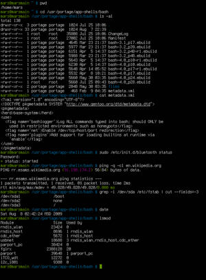
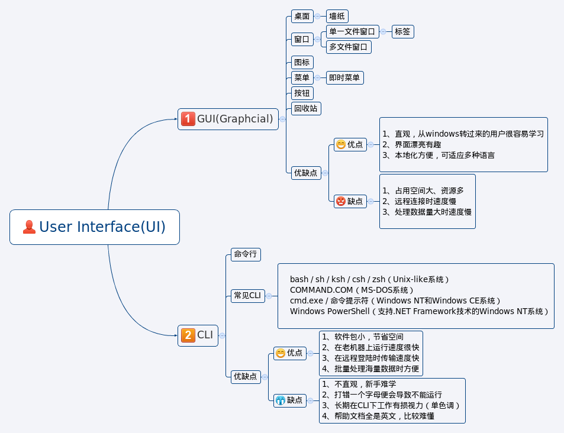

#GUI and CLI

###一图用户界面GUI
####图形用户界面（Graphical User Interface，简称GUI）是指采用图形方式显示的计算机操作用户界面。与早期计算机使用的命令行界面相比，图形界面对于用户来说在视觉上更易于接受。然而这界面若要通过在显示屏的特定位置，以“各种美观、而不单调的视觉消息”提示用户“状态的改变”，势必得比简单的文字消息呈现，花上更多的计算能力，计算“要改变显示屏哪些光点，变成哪些颜色”。

####历史变迁

* 1973年第一个可视化操作的Alto电脑在Xerox PARC完成。Alto是第一个把计算机所有元素结合到一起的图形界面操作系统。它使用3键鼠标、位运算显示器、图形窗口、以太网络连接。
* 1980年Three Rivers公司推出Perq图形工作站
* 1981年施乐公司推出了Alto的继承者Star，Alto曾首次使用了窗口设计
* 1983年苹果公司推出Apple Lisa个人电脑，是全球第一款搭载图形用户界面（GUI）的个人电脑。
* 1984年苹果公司推出Macintosh
* 1986年首款用于Unix的窗口系统X Window System发布
* 1988年IBM发布OS/2 1.10标准版演示管理器（Presentation Manager），这是第一种支持Intel计算机的稳定的图形界面
* 1992年微软公司发布Windows 3.1，增加了多媒体支持
* 1995年微软的Windows 95发布，其视窗操作系统的外观基本 型
* 1996年微软发布Microsoft Bob，此软件具有动画助手和有趣的图片
* 1996年IBM发布OS/2 Warp 4，它的交互界面得到显著改善，至今仍有不少ATM机运行这样的系统
* 1997年KDE和GNOME两大开源桌面项目启动
* 1997年苹果公司发布Mac OS 8，这个系统具有三维外观并提供了SpringLoaded Folder功能
* 2000年苹果公司漂亮的Aqua，也就是Mac OS X系统的默认外观，可以让用户更轻松地使用计算机
* 2001年微软发布Windows XP，实现桌面功能的集成
* 2003年Mac OS X v10.3提供了一键单击访问任何已打开窗口的功能
* 2003年Sun公司的Java桌面系统为GNOME桌面添加了和Mac类似的效果
* 2006年微软发布Windows Vista，对此前其视窗操作系统的外观作了较大的修改
* 2009年微软发布Windows 7，对此前其视窗操作系统不仅是外观，甚至是对硬件的支持都作了较大修改，比Vista降低了对硬件的要求
* 2012年微软发布Windows 8

####概要

在图形用户界面中，计算机画面上显示窗口、图标、按钮等图形，表示不同目的之动作，用户通过鼠标等指针设备进行选择。

1990年代早期Unix平台上运行的X Window System

#####桌面
在启动时显示，也是界面中最底层，有时也指代包括窗口、文件浏览器在内的“桌面环境”。在桌面上由于可以重叠显示窗口，因此可以实现多任务化。一般的界面中，桌面上放有各种应用程序和数据的图标，用户可以依此开始工作。桌面与既存的文件夹构成理念相违背，所以要以特殊位置的文件夹的参照形式来定义内容。比如在微软公司的Windows XP系统中，各种用户的桌面内容实际保存在系统盘（默认为C盘）:\Documents and Settings\[用户名]\桌面文件夹里。
墙纸，即桌面背景。可以设置为各种图片和各种附件，成为视觉美观的重要因素之一。

#####窗口
应用程序为使用数据而在图形用户界面中设置的基本单元。应用程序和数据在窗口内实现一体化。在窗口中，用户可以在窗口中操作应用程序，进行数据的管理、生成和编辑。通常在窗口四周设有菜单、图标，数据放在中央。
在窗口中，根据各种数据/应用程序的内容设有标题栏，一般放在窗口的最上方，并在其中设有最大化、最小化（隐藏窗口，并非消除数据）、最前面、缩进（仅显示标题栏）等动作按钮，可以简单地对窗口进行操作。

* 单一文件界面（Single Document Interface）
在窗口中，一个数据在一个窗口内完成的方式。在这种情况下，数据和显示窗口的数量是一样的。若要在其他应用程序的窗口使用数据，将相应生成新的窗口。因此窗口数量多，管理复杂。

* 多文件界面（Multiple Document Interface）
在一个窗口之内进行多个数据管理的方式。这种情况下，窗口的管理简单化，但是操作变为双重管理。

  * 标签
多文件界面的数据管理方式中使用的一种界面，将数据的标题在窗口中并排，通过选择标签标题显示必要的数据，这样使得接入数据方式变得更为便捷。

#####菜单
将系统可以执行的命令以阶层的方式显示出来的一个界面。一般置于画面的最上方或者最下方，应用程序能使用的所有命令几乎全部都能放入。重要程度一般是从左到右，越往右重要度越低。命定的层次根据应用程序的不同而不同，一般重视文件的操作、编辑功能，因此放在最左边，然后往右有各种设置等操作，最右边往往设有帮助。一般使用鼠标的第一按钮进行操作。

即时菜单（又称功能表、上下文菜单（Context Menu））
与应用程序准备好的层次菜单不同，在菜单栏以外的地方，通过鼠标的第二按钮调出的菜单称为“即时菜单”。根据调出位置的不同，菜单内容即时变化，列出所指示的对象目前可以进行的操作。

#####图标
显示在管理数据的应用程序中的数据，或者显示应用程序本身。
数据管理程序，即在文件夹中用户数据的管理、进行特定数据管理的程序的情况下，数据通过图标显示出来。通常情况下显示的是数据的内容或者与数据相关联的应用程序的图案。另外，点击数据的图标，一般可以之间完成启动相关应用程序以后再显示数据本身这两个步骤的工作。

应用程序的图标只能用于启动应用程序。

#####按钮
菜单中，利用程度高的命令用图形表示出来，配置在应用程序中，成为按钮。
应用程序中的按钮，通常可以代替菜单。一些使用程度高的命令，不必通过菜单一层层翻动才能调出，极大提高了工作效率。但是，各种用户使用的命令频率是不一样的，因此这种配置一般都是可以由用户自定义编辑。

#####回收站
为了实现文件删除的“假安全”功能而设置了“回收站”（垃圾桶）功能。在文件删除的时候，暂时将其移动到系统特定的地方，一旦用户发现删除错误，还可以将其找回，从而实现防止错误删除的目的。在麦金塔系统中，垃圾桶不仅可以删除文件，还可以进行各种各样对象的删除功能，如将可移动硬盘从系统中移出，将光盘从光驱中取出等等。

#####应用程序启动器将
从图形界面上启动应用程序有很多方式，有好几种操作系统都采用菜单形式的程序启动器。NEXTSTEP和Mac OS X中有一种称为dock的操作面板型的工具，可以存放各种文件和应用程序的信息，并通过鼠标点击调出。

####二、命令行界面CLI
命令行界面（英语：command-lineinterface，缩写：CLI）是在图形用户界面得到普及之前使用最为广泛的用户界面，它通常不支持鼠标，用户通过键盘输入指令，计算机接收到指令后，予以执行。也有人称之为字符用户界面（CUI）。

通常认为，命令行界面（CLI）没有图形用户界面（GUI）那么方便用户操作。因为，命令行界面的软件通常需要用户记忆操作的命令，但是，由于其本身的特点，命令行界面要较图形用户界面节约计算机系统的资源。在熟记命令的前提下，使用命令行界面往往要较使用图形用户界面的操作速度要快。所以，在现在的图形用户界面的操作系统中，通常都保留着可选的命令行界面。

虽然现在许多计算机系统都提供了图形化的操作方式，但是却都没有因而停止提供文字模式的命令行操作方式，相反的，许多系统反而更加强这部份的功能，例如Windows就不只加强了操作命令的功能和数量，也一直在改善Shell Programming的方式。而之所以要加强、改善，自然是因为不够好；操作系统的图形化操作方式对单一客户端计算机的操作，已经相当方便，但如果是一群客户端计算机，或者是24小时运作的服务器计算机，图形化操作方式有时会力有未逮，所以需要不断增强命令行界面的脚本语言和宏语言来提供丰富的控制与自动化的系统管理能力，例如Linux系统的Bash或是Windows系统的Windows PowerShell。

常见的CLI程序

bash / sh / ksh / csh / zsh（Unix-like系统）
COMMAND.COM（MS-DOS系统）
cmd.exe / 命令提示符（Windows NT和Windows CE系统）
Windows PowerShell（支持.NET Framework技术的Windows NT系统）

外部链接

> [Windows Server 2003 命令行参考](http://technet.microsoft.com/zh-cn/library/cc785423)－微软技术资源库

参见
> [人机交互](http://zh.wikipedia.org/wiki/%E4%BA%BA%E6%A9%9F%E4%BA%92%E5%8B%95)

> [用户界面](http://zh.wikipedia.org/wiki/%E4%BD%BF%E7%94%A8%E8%80%85%E4%BB%8B%E9%9D%A2)

> [图形用户界面](http://zh.wikipedia.org/wiki/%E5%9B%BE%E5%BD%A2%E7%94%A8%E6%88%B7%E7%95%8C%E9%9D%A2)

> [Unix shell](http://zh.wikipedia.org/wiki/Unix_shell)

